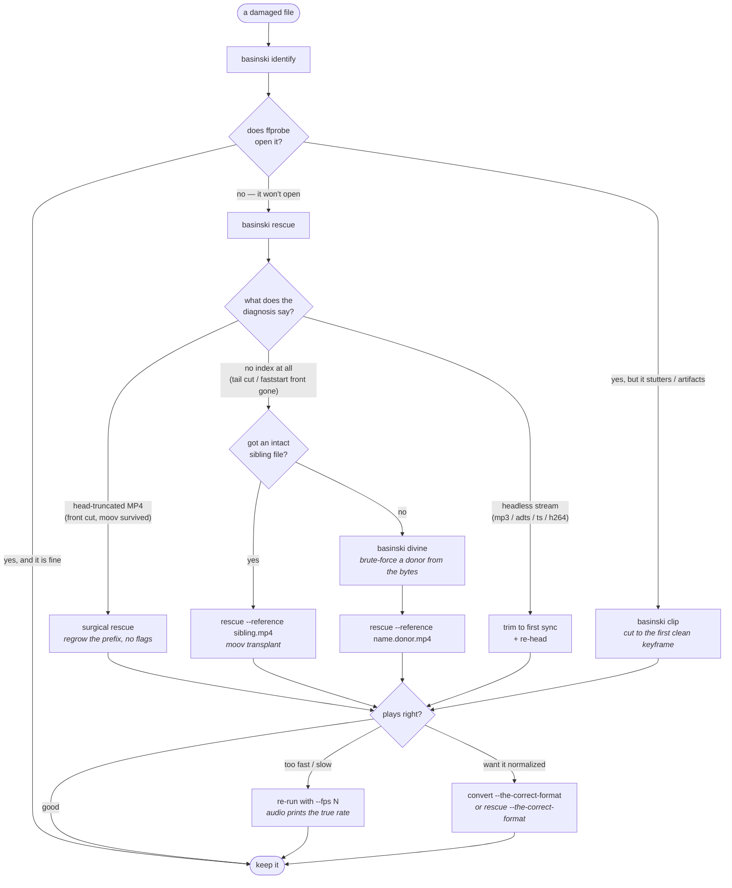

# basinski

**Rescues media files from their own disintegration.**

Named for William Basinski's *The Disintegration Loops* — music made from tape
loops that crumbled as they played back. This tool is for when your files do
the same thing, except you'd rather have them back.

```
$ basinski rescue head_truncated.mp4
◌ head_truncated.mp4 — 686556 bytes
  forensics:  80%  ISO BMFF / MP4 (damaged front)  [self-consistent atom chain: moov@678775 ...]

  diagnosis: head-truncated MP4
    bytes cut from front : 4096  (determined by stsz/NAL-chain correlation)
    media data destroyed : 4048 bytes
    keyframes destroyed  : 1 (first clean keyframe at 1.000s)

  ☼ regrew 4096-byte prefix (ftyp + free silence)
  container restored: mov,mp4, 6.000000s, video:h264 640x360, audio:aac
  ✂ clipping to first clean keyframe at 1.000s

  ✔ rescued → head_truncated.rescued.mp4
    full decode: clean (0 errors)
```

## What it does

- **`identify`** — forensic identification of audio/video, *headers or no
  headers*. Instead of magic bytes at offset 0, it hunts for codec-level
  structure anywhere in the file: MP3 frame-sync chains, ADTS headers,
  MPEG-TS packet cadence, H.264 NAL units (both Annex B start codes and
  MP4-style length prefixes), MP4 atom skeletons, EBML cluster IDs, Ogg pages.

- **`rescue`** — puts head-truncated MP4s back together. Most muxers write `moov`
  (the index, with every sample's *absolute byte offset*) at the **end** of
  the file, so cutting the head off kills `ftyp` and wounds `mdat`, but the
  index survives. basinski finds the surviving index, works out exactly how
  many bytes `K` died, and regrows a prosthetic prefix — a synthetic `ftyp`
  plus a `free` atom of structural silence — so every offset in the index is
  true again. Two ways it finds `K`:
  1. **mdat header anchor** — the surviving `mdat` header says where it sits
     now; the sample table says where it used to sit.
  2. **stsz/NAL-chain correlation** — when even the mdat header is gone, slide
     the sample-size table along the surviving bytes until the H.264
     length-prefixed NAL structure lines up. The index fits the data like a
     dental record.

  Media that was genuinely destroyed is zero-filled and then clipped away at
  the first clean keyframe (computed from the index, verified against the
  real packet list). Self-synchronizing formats with damaged heads (MP3,
  ADTS AAC, MPEG-TS, raw H.264) are trimmed to their first verifiable sync
  and re-headed.

- **`rescue --reference <intact-sibling>`** — the **moov transplant**, for
  when the index is gone *entirely*: a recording cut off mid-write, or a
  `faststart` file whose front died. This is what `untrunc` does, done by
  hand. An intact file from the same device speaks the same dialect — same
  SPS/PPS, same frame cadence, same muxing habits — so basinski harvests its
  organs (`stsd`, `tkhd`, timing) and regrows the index by walking the
  orphaned payload one NAL unit at a time: AVCC length prefixes chain sample
  to sample, `first_mb_in_slice == 0` marks each new access unit, IDR NALs
  rebuild the keyframe table. B-frame display order is recovered by parsing
  `pic_order_cnt_lsb` out of every slice header (field widths from the
  donor's SPS) and ranking POCs within each GOP — the `ctts` box regrows
  from the slices themselves, which is more than untrunc bothers with.
  Constant-sample-size audio (PCM) is split exactly. Variable-frame **AAC**
  is salvaged from the interleave gaps by recognizing the recurring CPE
  element header that opens every frame, wrapping each audio chunk in a
  synthetic ADTS header, and letting the decoder walk the blocks — no audio
  donor required, since ADTS is self-describing. The recovered audio doubles
  as a clock: its true duration over the video frame count **reveals the real
  frame rate**, which a parameter-less stream otherwise can't tell you.

  Because that stream carries no timing of its own, the donor's frame rate is
  only a guess. If a rescue comes out fast or slow, **`rescue --fps N`**
  re-times it without re-divining (basinski prints the audio-implied rate to
  tell you what N should be). `--no-audio` skips the audio salvage;
  `--audio-rate` overrides the assumed 44100 Hz.

- **`divine`** — when there is no index, no SPS/PPS, *and no intact sibling
  to borrow from*, basinski dowses for the lost codec parameters. The space
  of plausible parameter sets is small and testable: synthesize a candidate
  donor for each guess, decode the stream's own keyframe under it, and ask
  whether what came out looks like a *picture* — heavy-tailed edge
  statistics, quiet macroblock seams, sane chroma, frames that cohere with
  their neighbors. A wrong guess decodes to static; the right one produces
  borders and shapes. Resolution, entropy mode (the CABAC init-QP seed is
  swept outward from 26 — x264 writes its CRF straight into it), SPS field
  widths, reference counts, weighted prediction: all gridded, judged in
  parallel, and the winner is written out as a ready-made `--reference`
  donor. Drop a `mobilenetv2.onnx` in `~/.cache/basinski/` (or pass
  `--model`) and a tiny image classifier re-ranks the survivors — useful
  against the one illusion the classical metrics fall for, a wrong-geometry
  decode whose macroblocks reflow into locally-plausible shear.

- **`clip`** — identifies keyframes and clips artifacted-but-playable video
  to the first cleanly-decoding one. `--list` shows the keyframes; `--from`
  picks your own.

- **`convert --the-correct-format`** — converts any media to The Correct
  Format. The Correct Format is mp4 (H.264 + AAC) for video and mp3 for
  audio. There are no other formats. The flag is the entire format menu.

## A field guide: using the subcommands together

The five subcommands form a ladder of escalating desperation. You climb only
as far as the damage forces you to.



**The walkthrough.** You start every time with `identify` — it tells you what
the bytes *are* even when the extension lies and the header is gone. Then one
of three stories unfolds.

*The lucky case.* The file opens but hiccups — a corrupt run near the front,
clean footage after. `clip` finds the first keyframe that decodes cleanly and
cuts to it. Done.

*The surgical case.* `rescue` looks at an MP4 that ffprobe won't touch and
finds the `moov` index alive at the tail (most muxers write it there). The
front — `ftyp`, the `mdat` header — is what died. basinski works out exactly
how many bytes `K` were lost and regrows a prosthetic prefix so every offset
in the surviving index points true again. No flags, no donor; the rescue is
deterministic and, for a clean head-truncation, bit-identical to the original.

*The hard case.* The index itself is gone — the tail was cut, or the file was
`faststart` and its front (where `moov` then lived) is the casualty. Now there
is nothing saying where samples begin. Two ways forward:

- **You have a sibling** — any intact clip from the same camera or app.
  `rescue --reference sibling.mp4` harvests its codec parameters and walks the
  orphaned `mdat` to rebuild the index (this is what `untrunc` does).
- **You have nothing but the wreck.** `divine` manufactures the donor. It
  brute-forces the lost parameters by synthesizing candidates, decoding the
  file's own keyframe under each, and scoring whether the result *looks like a
  picture*. It writes `<name>.donor.mp4`, which you then hand to
  `rescue --reference`.

**The last mile.** A transplanted stream carries no timing of its own, so it
may come out overcranked. basinski salvages the AAC audio from the gaps
between video frames, and that audio is a clock: it prints the frame rate it
implies. Re-run `rescue --fps N` to set it right — no re-divining. Finally, if
you want the survivor in a tidy, universally-playable container,
`--the-correct-format` (on `rescue` or `convert`) re-encodes it to H.264+AAC
mp4, or mp3 for audio.

A real two-step session, start to finish, on a file with no index and no
sibling:

```sh
basinski identify wreck.bin            # → "H.264 in MP4 framing", no moov
basinski divine   wreck.bin            # → wreck.donor.mp4  (prints "~25 fps")
basinski rescue   wreck.bin --reference wreck.donor.mp4 --fps 25
                                       # → wreck.rescued.mp4, video + sound
```

## Install / build

```sh
cargo build --release   # binary at target/release/basinski
```

Requires `ffmpeg` and `ffprobe` on PATH for rescue/clip/convert/divine (the
forensic `identify` works without them; `divine` additionally wants libx264
in your ffmpeg for donor synthesis). Everything else is plain Rust: `clap`,
`anyhow`, `serde`, and `tract-onnx` for the optional neural second opinion —
the parsing, scanning, bit-splicing, and reconstruction are done by hand, by
candlelight.

## Shell completions

`basinski completions <shell>` prints a completion script to stdout, with every
subcommand, flag, and file argument described. For zsh:

```sh
basinski completions zsh > ~/.zfunc/_basinski   # ensure ~/.zfunc is in your $fpath
# then in ~/.zshrc, before `compinit`:           fpath=(~/.zfunc $fpath)
```

`bash`, `fish`, `powershell`, and `elvish` work the same way — swap the shell
name. The script is generated from the CLI definition, so it never drifts out of
date; re-run it after upgrading.

## Honest limitations

- A head-truncated MP4 without a surviving `moov` needs a `--reference` file from
  the same device — or `divine`, which manufactures one by brute force. The
  divination grid covers progressive H.264 in its common shapes; interlaced
  field coding, multi-PPS streams, and 10-bit profiles are outside it (so
  far), and basinski will tell you so plainly.
- `divine`'s evidence is one keyframe plus a handful of trailing slices;
  parameters that only misbehave deeper into a stream (frame_num wrapping
  past the evidence, say) can slip through.
- Salvaged AAC assumes stereo AAC-LC at 44100 Hz (override with
  `--audio-rate`); a few gaps that don't frame cleanly are skipped, so the
  audio can run a touch short and drift slightly from the video by the end.
- A transplanted stream has no timing of its own, so playback speed depends
  on `--fps`; the recovered audio reports the true rate but you have to pass
  it back in.
- The transplant walks H.264 (avc1/avc3) payloads only; HEVC grammar is not
  implemented yet.
- Transplanted AAC audio is dropped: raw AAC frames in an MP4 have no sync
  words, so splitting them requires a decoder in the loop, which basinski
  refuses to pretend it has. PCM audio recovers exactly.
- A truncation that lands mid-GOP costs the trailing B-frames; the last
  recovered reference frame then displays a beat early. Data that died
  stays dead.
- The whole file is read into memory; fine for phone videos, rude for 100 GB
  masters.
- `K` detection is verified against the data (≥80% of sampled video samples
  must parse as valid NAL chains at the proposed alignment) before any
  reconstruction is attempted.

## Tests

```sh
cargo test
```

Unit tests cover the frame-sync scanners, the full head-truncate→analyze→rebuild
cycle on synthetic MP4s (clean head-truncation, cut through the mdat header, cut
deep into media, moov loss), and the transplant (tail cut, head cut at unknown
phase, exact PCM splitting, honest AAC dropping). The end-to-end script
head-truncates a real mp4 two ways and rescues both, then cuts the last 40% off
another — taking the entire index with it — and rescues that through a
donor file. All three decode with zero errors; the first is bit-identical.

## License

basinski is free software, licensed under the **GNU General Public License,
version 3 or later** (GPL-3.0-or-later). See [`LICENSE`](LICENSE) for the full
text. The copyleft is deliberate: the recovery work leans on GPL codec tooling
(libx264 for donor synthesis), so basinski is GPL too — use it, study it, share
it, and pass on the same freedoms.
